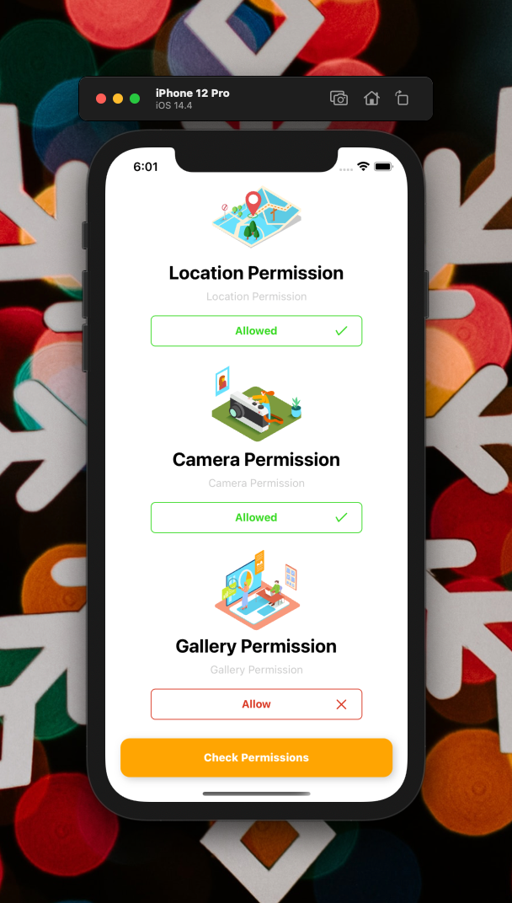

[](https://github.com/WrathChaos/react-native-permission-item)

[](https://www.npmjs.com/package/react-native-permission-item)
[](https://www.npmjs.com/package/react-native-permission-item)

[](https://opensource.org/licenses/MIT)
[](https://github.com/prettier/prettier)

<table>
  <tr>
    <td align="center">
      
    </td>
    <td align="center">
      
    </td>
   </tr>
</table>

# Installation

Add the dependency:

```bash
npm i react-native-permission-item
```

## Peer Dependencies

<h5><i>IMPORTANT! You need install them</i></h5>

```js
"@freakycoder/react-native-bounceable": ">= 0.2.4"
```

# Usage

## Import

```jsx
import PermissionItem from "react-native-permission-item";
```

## Fundamental Usage

```jsx
<PermissionItem
  title="Location Permission"
  isGranted={isLocPermGranted}
  source={require("./assets/permissions/map.png")}
  description="We need this permission for the geolocation based app to function functionally"
  onPress={this.handleRequestLocPermission}
/>
```

## Example Project 😍

You can checkout the example project 🥰

Simply run

- `npm i`
- `react-native run-ios/android`

should work of the example project.

# Configuration - Props

## Fundamentals

| Property    |   Type   |  Default  | Description                                                        |
| ----------- | :------: | :-------: | ------------------------------------------------------------------ |
| title       |  string  | undefined | change the title                                                   |
| description |  string  | undefined | change the descrition                                              |
| source      |  Image   | undefined | set your own image                                                 |
| isGranted   | boolean  |   false   | set and change the granted or not button text                      |
| onPress     | function | undefined | set your own logic for the button functionality when it is pressed |

## Future Plans

- [x] ~~LICENSE~~
- [ ] Write an article about the lib on Medium

# Change Log

Change log will be here !

## Author

FreakyCoder, kurayogun@gmail.com

## License

React Native Permission Item is available under the MIT license. See the LICENSE file for more info.
